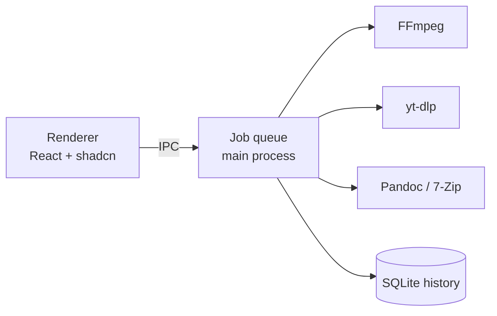

# Sparky — Product Spec

Sep 24, 2026

## Overview

Sparky is a Windows desktop app that converts local files and downloads media from links, fully offline for conversion and with zero setup. It pairs a Raycast-style compact, monochrome UI with a scroll-driven landing site.

**Goals**

- Convert video, audio, images, documents and archives with one-click presets and an optional Advanced panel.
- Download from YouTube and every other yt-dlp supported site, including playlists and channels, up to 4K.
- Chain download → convert in one step (for example, a link straight to MP3).
- Let the user pick how hard Sparky works through a Low / Normal / Max Performance control.

**Non-goals (v1)**

- macOS and Linux builds.
- Upscaling beyond the source resolution.
- Cloud processing, accounts or sync. Everything runs on the user's machine.

## Platform & architecture

Sparky is an Electron app for Windows 10/11 (x64), with React + shadcn/ui in the renderer and a Node job engine in the main process that drives bundled binaries.

| Layer | Choice |
| --- | --- |
| Shell | Electron, packaged with electron-builder (NSIS installer) |
| UI | React, TypeScript, Vite, Tailwind, shadcn/ui, lucide-react, Framer Motion |
| Job engine | Main-process queue spawning child processes; IPC via contextBridge |
| Video / audio / images | FFmpeg (bundled), sharp for fast image paths |
| Documents | Pandoc (bundled) for MD/DOCX/HTML; LibreOffice headless optional for DOCX → PDF |
| Archives | 7-Zip (bundled 7za) for ZIP, 7z, RAR extraction and repacking |
| Downloads | yt-dlp (bundled), self-updated on launch via `yt-dlp -U` with a fallback manual update button |
| Storage | SQLite (better-sqlite3) for history and settings |

The renderer never touches the filesystem directly; every job goes through the queue so progress, cancel and history stay consistent.

## Converter

The converter takes dropped or picked files, applies a preset, and writes results to per-type folders, with an Advanced panel and a Performance control for finer choices.

| Category | Inputs (examples) | Outputs (examples) |
| --- | --- | --- |
| Video | MP4, MKV, MOV, WEBM, AVI | MP4, WEBM, MKV, GIF, MP3 (extract) |
| Audio | MP3, WAV, FLAC, M4A, OGG | MP3, WAV, FLAC, M4A, OGG |
| Images | PNG, JPG, WEBP, HEIC, BMP, GIF | PNG, JPG, WEBP, AVIF, ICO |
| Documents | DOCX, MD, HTML, PDF | PDF, DOCX, MD, HTML, TXT |
| Archives | ZIP, 7Z, RAR | ZIP, 7Z (RAR is extract-only) |

**Format picker.** A searchable dropdown (shadcn Combobox built on Command) grouped by category, showing only formats valid for the selected input.

**Presets + Advanced.** Each target format has presets such as "Small", "Balanced" and "High quality". An Advanced accordion exposes bitrate, resolution, codec, quality, trim start/end and image resize.

**Performance.** A control with a lucide `Zap` icon and three levels:

| Level | Behavior |
| --- | --- |
| Low | Minimal resource use, single thread, low process priority |
| Normal | Regular speed, multi-threaded CPU encoding |
| Max | Full GPU use (NVENC / AMF / QSV when detected), all cores; heaviest on batch jobs |

The control is a row of bars that fill left to right and animate with a shifting color gradient, like an effort-level selector: one bar for Low, three for Normal, all five for Max, with the bars gently fluctuating while a job runs. If no supported GPU is found, Max falls back to all CPU cores and says so.

**Originals.** Originals are kept by default. A per-job toggle offers "Replace original" or "Delete original after success", with a confirm dialog and a move to the Recycle Bin rather than a hard delete.

**Batch.** Multiple files (or a whole folder) can be dropped at once; each becomes its own job in the queue, and with Batch conversion on several run side by side.

**Resolution: 1440p and 4K.** Downloads and video conversions offer 720p, 1080p, 1440p and 4K (2160p). The two higher options unlock only when all three conditions hold; otherwise they show greyed out with the reason as a tooltip.

| Condition | Check | If it fails |
| --- | --- | --- |
| Source resolution | ffprobe (files) or yt-dlp format list (links) reports ≥ the target height | Option hidden; Sparky never upscales |
| Performance level | Performance is set to Max | Tooltip: "Switch to Max to unlock 1440p/4K" |
| GPU support | NVENC, AMF or QSV encoder detected for the chosen codec (H.264, HEVC, AV1) | Tooltip says in plain words why it is locked |

**Compression.** Every video, audio and image conversion has a Compression control with five levels, shown as a slider with labelled stops. Each level maps to encoder settings, and the result card shows before and after sizes with the percentage saved.

| Level | Video (CRF / CQ) | Audio | Images (quality) |
| --- | --- | --- | --- |
| Lossless ("Original quality export") | CRF 16 | 320 kbps / FLAC | 95 |
| High | CRF 20 | 256 kbps | 88 |
| Balanced (default) | CRF 23 | 192 kbps | 80 |
| Small | CRF 28 | 128 kbps | 70 |
| Tiny | CRF 32 + 0.5× scale cap | 96 kbps | 55 |

PDFs use Ghostscript presets for High, Balanced and Small. Archives use the 7-Zip compression level (store to ultra). Compression can also run on its own: pick the same format as the input to shrink a file without converting it.

## Downloader

The downloader accepts any yt-dlp supported link, previews it, and downloads video or audio up to 4K, optionally converting in the same job.

**Flow**

1. Paste a link, or accept one offered by clipboard detection.
2. Sparky fetches metadata and shows a preview card: thumbnail, title, channel, duration and size estimate.
3. For a playlist or channel, a checklist lists every item with select-all, search and a count.
4. Pick a mode (Video or Audio), a quality (up to 4K, per the resolution rules) and an optional "Convert to" format.
5. Press the main **Convert** button to queue the job.

**Extras (toggles, remembered per user)**

- Embed thumbnail
- Subtitles: download or embed, with language choice
- Metadata / ID3 tags (title, artist, album, chapters)
- SponsorBlock: remove sponsor, intro and self-promo segments

**Download → convert.** When "Convert to" is set, the finished download passes straight into the converter with the chosen preset and Performance level, and appears as one job with two stages.

**Resilience.** yt-dlp updates itself on launch. If a site breaks, the error toast offers "Update yt-dlp" and "Retry".

## Jobs, history & system

Every conversion and download is a job in one shared queue, with a Batch conversion switch and a searchable history.

| Feature | Behavior |
| --- | --- |
| Batch conversion | One on/off switch in Settings, on by default. On, Sparky picks how many jobs run together from the Performance level and the PC: Low 1, Normal 2, Max half the processor threads clamped to 2–4 (`batchConcurrency` in core). Off, one at a time. An old stored `concurrency` number migrates to on when it was above 1 |
| Job controls | Pause, resume, cancel, retry; drag to reorder pending jobs |
| Progress | Bar per job with percent, speed (MB/s or x realtime) and ETA |
| History | Saved in SQLite: source, output path, settings, duration, status; search, filter, "Re-run" and "Show in folder" |
| Output folders | Per-type folders under a root (default `Documents\Sparky`): Video, Audio, Images, Documents, Archives, Downloads |
| Clipboard detection | On focus, a supported link in the clipboard offers a one-click "Download this?" chip |
| System tray | Close to tray; tray menu shows active jobs, "Paste link", Open, Quit |
| Notifications | Windows toast on job complete or failure; click opens the file or the folder |

## App UI

The app is compact and Raycast-style: a monochrome, sidebar layout with a queue docked at the bottom, following the Windows light/dark theme.

**Layout**

- Left sidebar (lucide icons): Convert, Download, Queue, History, Settings. Collapsible to icons only.
- Main pane: the active section.
- Bottom dock: the live job queue, always visible, expandable by dragging its top edge.
- Footer under the dock: an email link (harryx2011@gmail.com) with the Gmail icon, and a Discord handle (ogexr.) with the Discord icon that copies the handle on click. Brand icons come from an icon package such as Simple Icons, not hand-drawn.

**Visual system**

- Monochrome palette: shadcn zinc/neutral tokens only; no accent hue. Color appears only for states (success, error) and in the Performance bars.
- Compact density: 13–14 px body text, 32 px controls, 8 px radius, 1 px hairline borders.
- Typography: Inter or Geist for UI, Geist Mono for sizes, speeds and timings.
- Custom frameless title bar with Windows-style caption buttons.

**Key shadcn components:** Sidebar, Command/Combobox, Accordion, Toggle Group, Progress, Card, Checkbox, Dialog, Sonner toasts, Tooltip, Resizable.

**Motion:** Framer Motion for panel transitions, queue item enter/exit, and a short spark burst when a job completes.

## Landing website

The landing site is a monochrome, scroll-driven page in the same visual language as the app, with rich scroll and spark animations. It's Raycast-inspired in tone but has its own layout and content.

| # | Section | Scroll behavior |
| --- | --- | --- |
| 1 | Hero: logo, tagline, Download for Windows | Spark particles drift; app window rises and tilts flat as you scroll |
| 2 | Drop anything | A file icon falls into the window and morphs into a new format |
| 3 | Paste any link | Link types out, preview card and playlist checklist assemble |
| 4 | Performance | Low → Normal → Max bars fill and shift color, pinned while you scroll |
| 5 | Queue | Jobs stack up with live-looking progress, speed and ETA |
| 6 | Features grid | Tray, notifications, history, SponsorBlock, subtitles cards fade in staggered |
| 7 | Download CTA | Large spark burst and the download button |
| 8 | Footer | Gmail and Discord contact, same as the app |

It's built as static HTML/React with scroll-linked animations; reduced-motion users get static fades.

## Milestones & open questions

| Milestone | Scope |
| --- | --- |
| M1: Scaffold | Electron + Vite + shadcn shell, sidebar, docked queue, footer, theme |
| M2: Converter | FFmpeg/sharp/Pandoc/7-Zip jobs, presets, Advanced, Performance, 1440p/4K, compression |
| M3: Downloader | yt-dlp metadata, preview card, playlist checklist, extras, download → convert |
| M4: System | History, tray, notifications, clipboard detection, settings |
| M5: Ship | Installer, auto-update, landing site live |

**Decisions (were open questions)**

- [x] **DOCX → PDF:** LibreOffice is *not* bundled. If it's installed, Sparky uses it; otherwise Pandoc turns the document into HTML and Electron's built-in Chromium prints it to PDF.
- [x] **App updates:** yes. electron-updater checks GitHub Releases on launch, and yt-dlp still updates itself separately via `yt-dlp -U`.
- [x] **Hosting:** the landing site deploys to Vercel (https://sparky-labs.vercel.app, project `sparky-labs`, production branch `main`); the installer is `Sparky-Setup.exe` on GitHub Releases.
- [x] **Logo:** the bolt in a rounded tile, rendered by `scripts/make-icons.mjs`.
- [x] **License:** MIT. Bundled tools keep their own licenses (see `THIRD_PARTY_NOTICES.md`).
- [x] **Bundled tools:** not stored in git. `scripts/fetch-tools.mjs` downloads the Windows builds before packaging, so users still get zero setup.

## Build notes

Places where the build refines the draft spec:

- **Presets are the Compression levels.** "Small", "Balanced" and "High quality" already appear as Compression stops, so the format picker shows the chosen level (for example "MP4 · Balanced") instead of a second preset list.
- **Mixed batches:** when files of different types are dropped together, each type gets its own format picker, and they all share Performance, Compression and Resolution.
- **Output folders follow the output:** sound pulled from a video goes to `Audio`, not `Video`.
- **PDF input** can become TXT or MD (text pulled out with pdf.js), or a smaller PDF. Shrinking PDFs needs Ghostscript, which is optional; the control explains this when it's missing.
- **RAR** extraction uses the full 7-Zip (`7z.exe` + `7z.dll`). If only the standalone `7za` could be fetched, RAR shows a friendly error.
- **YouTube** needs a JavaScript runtime for yt-dlp these days, so Deno is bundled and passed with `--js-runtimes`.
- **Pause:** Windows can't freeze a child process, so pausing stops it. Downloads resume where they left off (yt-dlp keeps partial files); conversions start over. The UI says so.
- **Max without a GPU encoder**, or when the driver rejects a job, falls back to the CPU and says so on the job.
- **Plain language:** the interface says "graphics card", "shrink" and "sound quality" instead of encoder and codec terms. The technical options live under "More options".
